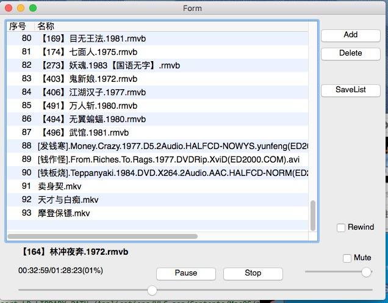
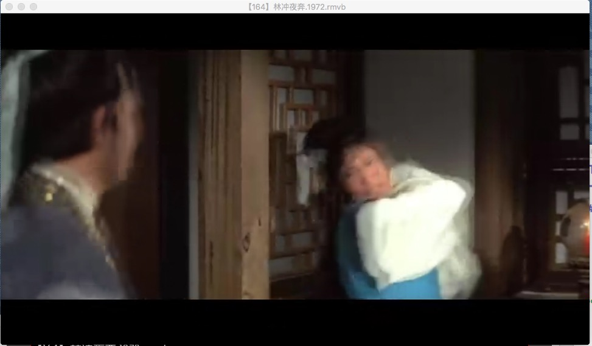

vlc player for python 
---------------------

###mac osX

	python2.7  qt4.7+
	
	brew install qt4
	brew install sip 
	brew install pyqt
	pip install YAML 

	export PYTHONPATH=/usr/local/Cellar/pyqt/4.11.4/lib/python2.7/site-packages:/usr/local/Cellar/sip/4.16.9/lib/python2.7/site-packages

	export LD_LIBRARY_PATH=/Applications/VLC.app/Contents/MacOS/plugins
	export VLC_PLUGIN_PATH=/Applications/VLC.app/Contents/MacOS/plugins

test Okay: 
	
	from PyQt4 import QtCore 
	

### Run Player

	python vlc_player.pyw
	

 

	